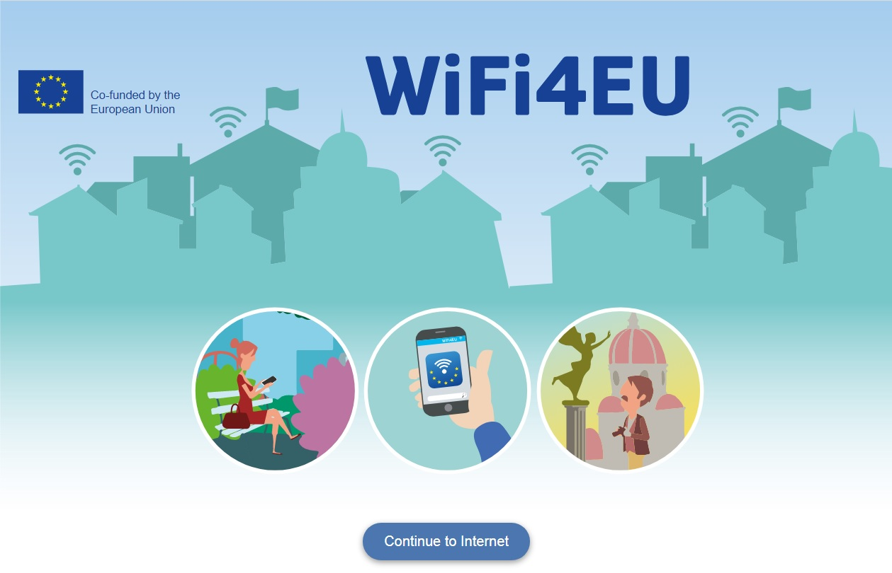

# WiFi4EU - Portal

## Overview
WiFi4EU is a free Wi-Fi hotspot service promoted by European Comission to provide connectivity for citizens and visitors in public spaces such as parks, squares, public building, libraries, health centres, and museums everywhere in Europe. The WiFi4EU programme requires the use of a captive portal that connects to the WiFi4EU metrics infrastructure. More information about this is available here: https://ec.europa.eu/digital-single-market/en/news/wifi4eu-tracking-snippet-guideline

EnGenius Cloud and ezMaster provide managed WiFi with the ability to host your own "Splash Page", which is a captive portal service for authenticating users to join the network. This concept is called an External Captive Portal. 

EnGenius supports two ways to work with external splash page: **click-through** and **sign-on**. This application takes the click-through as an example.

To get started just host these files in the public directory on any web server such as nginx, Apache or Firebase Hosting and configure your SSID to use your server.

## Installation
* Edit splash.html to modify two variables **wifi4euNetworkIdentifier** and **wifi4euLanguage**, and remove **var selftestModus = true;**.
* Host splash.html on your static webserver such as Apache, Nginx, GitHub or Firebase, etc.
* Configure the Engenius Cloud SSID setting with a Click-Through splash page authentication
    * Select Captive Portal Tab
    * Enabled --> Switch to Enabled
    * Authentication Type --> Select Click-through
    * Advanced Setting --> Walled Garden
        * Add the domain of the WiFi4EU suporting resources  **collection.wifi4eu.ec.europa.eu**
    * Select Splash Page Tab
        * Splash Page Type --> Select External Splash Page URL
        * Point the "Customer URL" to the HTML file. ex: `https://yourserver/splash.html`

## Screenshot

